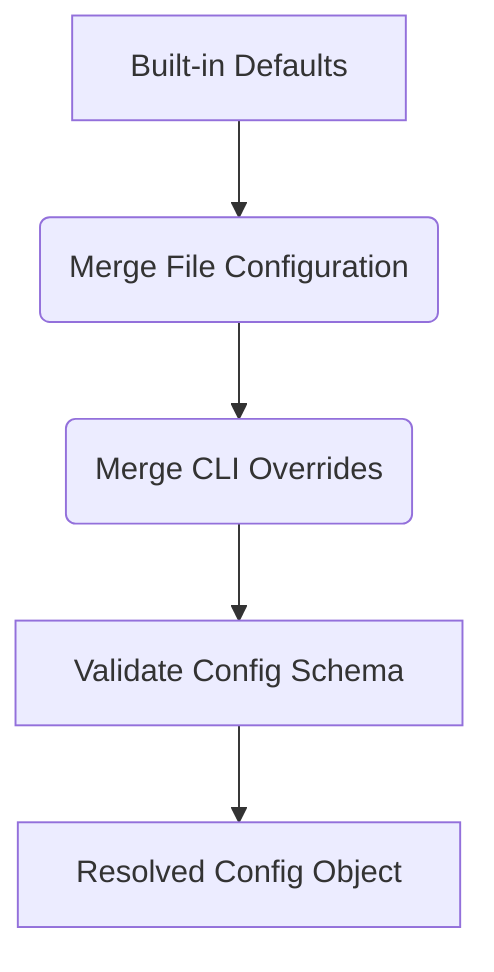

# OpenFlow Configuration Reference

This reference details OpenFlow's configuration system, detailing the loading sequence, precedence hierarchy, validation rules, and built-in defaults.

---

## 1. Config Loading & Resolution

When OpenFlow initializes, it resolves config values through a three-stage pipeline:



### Loading Sequence
1.  **Read CLI Path**: If `-c` or `--config <path>` is specified, the CLI attempts to read that configuration file. If the file cannot be read or contains invalid YAML, a `CONFIG_VALIDATION_ERROR` is thrown.
2.  **Default Location fallback**: If no CLI config flag is provided, the CLI looks for `.openflow/config.yaml` in the active project directory. If it is missing, the loading continues using only built-in defaults.
3.  **Merge CLI Options**: Overrides are applied from the command line (e.g. `--concurrency`, `--timeout-ms`, `--report`).
4.  **Schema Validation**: The merged configuration object is validated. Any discrepancy raises an exit code 3 (`Workflow parse or validation error`).

---

## 2. Configuration Options & Schema Validation

### Global Settings

| Option | Type | Default | Validation Rules | Description |
| :--- | :--- | :--- | :--- | :--- |
| `defaultProvider` | `string` | `"mock"` | Must be a key defined in `providers`. | Fallback provider used for agent calls if unspecified. |
| `concurrency` | `integer` | `4` | Positive integer (>= 1). | Maximum parallel tasks executed concurrently by the scheduler. |
| `timeoutMs` | `integer` | `900_000` | Positive integer (>= 1) in ms. | Global timeout for workflow execution. |
| `defaultModel` | `string \| null` | `null` | String, null, or undefined. | Global model override fallback for provider execution. |
| `workflow.maxDepth` | `integer` | `8` | Positive integer (>= 1). | Maximum recursion/invocation depth for nested workflows. |
| `failFast` | `boolean` | `false` | Boolean. | If true, aborts execution immediately on the first task failure. |

---

### `providers` Settings

A dictionary mapping provider names to provider config objects.

| Option | Type | Default | Validation Rules | Description |
| :--- | :--- | :--- | :--- | :--- |
| `command` | `string` | *(Required)* | Non-empty string. | Executable binary run in a subprocess (e.g., `codex`, `gemini`). |
| `args` | `string[]` | `[]` | Array of strings. | Command-line arguments prepended before agent arguments. |
| `defaultModel` | `string \| null` | `null` | String, null, or undefined. | Fallback model override for this provider. |
| `modelArg` | `object \| false`| `undefined` | Must be `false` or object containing `{ flag: string }`. | Dictates how the model option is passed to the provider binary. |
| `promptMode` | `string` | `undefined` | Must be `"stdin"` or `"arg"`. | `"stdin"` writes prompts to the process stdin. `"arg"` appends it as a final command line argument. |

#### Built-in Provider Defaults

```yaml
providers:
  mock:
    command: "mock"
    args: []
    defaultModel: null
    responses:
      default:
        text: "mock response"
  codex:
    command: "codex"
    args:
      - "exec"
      - "--json"
      - "--ephemeral"
    defaultModel: null
  gemini:
    command: "gemini"
    args:
      - "--output-format"
      - "json"
      - "--approval-mode"
      - "plan"
    defaultModel: "gemini-3-flash-preview"
    promptMode: "stdin"
```

---

### `security` Settings

Enforces sandbox constraints for workflow execution.

| Option | Type | Default | Validation Rules | Description |
| :--- | :--- | :--- | :--- | :--- |
| `allowWorkflowImports` | `boolean` | `false` | Must be strictly `false` in MVP. | Blocks workflows from importing arbitrary packages. |
| `passEnv` | `string[]` | `[]` | Array of strings. | Allowlist of environment variables propagated to provider processes. |
| `redactEnv` | `string[]` | *(See below)* | Array of strings. | List of environment variable values redacted from outputs and logs. |

#### Default Redaction List
To prevent accidental credentials leakage, the following environment variables (and matching wildcard pattern values) are redacted:
*   `OPENAI_API_KEY`
*   `GEMINI_API_KEY`
*   `GOOGLE_API_KEY`
*   `*_KEY`
*   `*_TOKEN`
*   `*_SECRET`
*   `PASSWORD`

---

### `reporting` Settings

Controls visual outputs and terminal formatting.

| Option | Type | Default | Validation Rules | Description |
| :--- | :--- | :--- | :--- | :--- |
| `mode` | `string` | `"pretty"` | Must be `"pretty"`, `"json"`, or `"jsonl"`. | Layout format printed to stdout (terminal visualization vs structured logs). |
| `verbose` | `boolean` | `false` | Boolean. | Enables debugging messages. |

---

## 3. Override Resolution Precedence

When evaluating configuration keys (like `model` or `timeoutMs`), the runtime resolves properties using the following hierarchy (highest precedence first):

1.  **Agent DSL Parameter**: Options explicitly supplied inside the script code (e.g. `agent({ model: "custom" })`).
2.  **CLI Flag Overrides**: Arguments provided directly on shell execution (e.g. `openflow run --model overridden-model`).
3.  **YAML File Configuration**: Properties declared in `.openflow/config.yaml`.
4.  **Built-in Defaults**: Fallback values defined in OpenFlow's core engine defaults.

---

## 4. Shared Agents Configuration (`sharedAgents`)

Shared agent settings dictate how reusable, code-based agent definitions are loaded and validated:
*   `sharedAgents`:
    *   `dir`: Directory path scanned for shared agent definitions (defaults to `".openflow/agents"`).
    *   `maxDefinitions`: Positive integer limit on the maximum definitions loaded (defaults to 100).
    *   `allowDynamicIds`: Must be strictly `false` (dynamic shared agent IDs are rejected for security reasons).
    *   `strictPromptTemplateVariables`: Boolean specifying if template variables must match declared schema properties.

---

## 5. Tools Configuration (`tools`)

Tools settings dictate how reusable, trusted application extensions declared with `defineTool()` are loaded, validated, and executed:

| Option | Type | Default | Validation Rules | Description |
| :--- | :--- | :--- | :--- | :--- |
| `dir` | `string` | `".openflow/tools"` | Non-empty path string. | Directory path scanned for tool definitions. |
| `concurrency` | `integer` | `4` | Positive integer (>= 1). | Maximum parallel tool calls executed concurrently by the tool execution lane. |
| `maxDefinitions` | `integer` | `100` | Positive integer (>= 1). | Limit on the maximum tool definitions loaded. |

Example config snippet:
```yaml
tools:
  dir: ".openflow/tools"
  concurrency: 4
  maxDefinitions: 100
```

